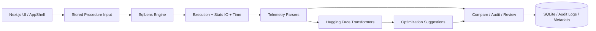
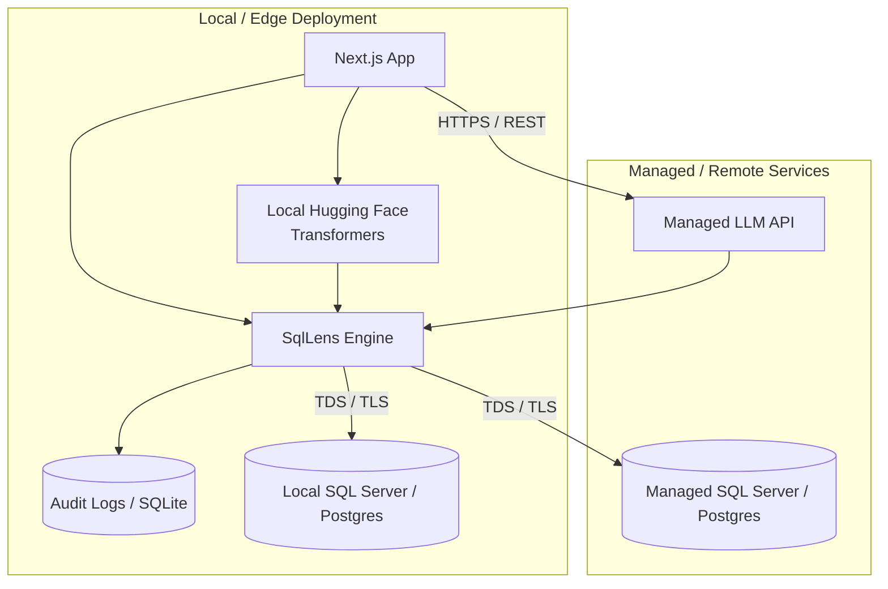

This is a [Next.js](https://nextjs.org) project bootstrapped with [`create-next-app`](https://nextjs.org/docs/app/api-reference/cli/create-next-app).

# SQLLens

SQLLens is an AI-assisted SQL stored procedure analysis and optimization platform designed to ingest stored procedures, execute them against SQL Server or PostgreSQL, capture execution telemetry, analyze IO and timing metrics, and propose optimization recommendations with LLM-backed reviews. The project combines a Next.js application shell, a local execution engine, telemetry parsers, and model management workflows for review, comparison, and auditing.

## Getting Started

First, run the development server:

```bash
npm run dev
# or
yarn dev
# or
pnpm dev
# or
bun dev
```

Open [http://localhost:3000](http://localhost:3000) with your browser to see the result.

You can start editing the page by modifying `app/page.tsx`. The page auto-updates as you edit the file.

This project uses [`next/font`](https://nextjs.org/docs/app/building-your-application/optimizing/fonts) to automatically optimize and load [Geist](https://vercel.com/font), a new font family for Vercel.

## Architecture Overview

SqlLens is built as a layered system that separates end-user workflows from execution and analysis components. The architecture is deliberately split between a web application layer, a SQL execution engine, telemetry parsers, and a Hugging Face Transformers-powered optimization layer.

### System Components

- SqlLens Engine: Executes stored procedures in local simulation mode or via real database drivers for SQL Server (`mssql`) and PostgreSQL (`pg`), and records execution statistics and audit logs.
- LLM Layer: Uses Hugging Face `transformers` models to review, explain, and optimize stored procedures based on captured telemetry, query patterns, and IO anomalies.
- SQL Server / PostgreSQL: Source systems where stored procedures run, producing `STATISTICS IO`, `STATISTICS TIME`, and execution plans.
- Telemetry Parsers: Normalize raw SQL engine output into structured metrics such as logical reads, physical reads, scan counts, CPU time, elapsed time, and hot tables.
- Audit Log Store: Persists execution records to `audit_logs` and supports later comparison and review.

### Core Data Flow

1. SP Extraction: A stored procedure definition is entered via the app UI or API.
2. Execution + Stats Capture: The engine executes the SP in simulation or live mode and gathers raw IO / time output.
3. Telemetry Normalization: Parsers convert raw outputs into machine-readable performance metrics.
4. Comparative Analysis: The original and optimized SPs are compared using logical reads, scan counts, and elapsed time.
5. LLM Optimization: The Transformers-based LLM layer reviews the procedure and suggests index, query, or rewrite improvements.
6. Upsert / Persistence: The results, comparison summaries, and audit metadata are stored for later inspection and recommendation tracking.



## Network Topology & Deployment Diagram

SqlLens supports a flexible deployment model spanning local edge execution and remote managed services, with a local Hugging Face Transformers inference path as the primary AI layer.

### Deployment Boundaries

- Local / Edge deployment:
  - Next.js app runs locally on developer machines or a private edge node.
  - Hugging Face Transformers executes locally in-process or through a privately hosted local inference service.
  - SQLite or local audit storage can persist execution metadata and application state.
  - SQL connectivity remains inside the private trust boundary when connecting to local SQL Server or PostgreSQL instances.

- Remote / Managed deployment:
  - Managed SQL Server or PostgreSQL instances can be accessed over the network.
  - Remote model endpoints or managed AI APIs may be used if configured for cloud inference.
  - Cloud-hosted telemetry, review services, or shared model backends may be used if the deployment requires them.

### Protocol and Port Reference

| Component | Network Path | Typical Port / Protocol | Purpose |
| --- | --- | --- | --- |
| Web App UI | HTTP / HTTPS | 3000 | User interface and operational dashboard |
| SQL Server | TDS / TLS | 1433 | SQL Server connections |
| PostgreSQL | PostgreSQL wire protocol | 5432 | PostgreSQL connectivity |
| Local Transformers Runtime | In-process / local REST bridge if enabled | 8000 or local IPC | Local model inference within the same trust boundary |
| Managed LLM API | HTTPS / REST | 443 | Remote model provider access |
| Audit Log / Local Storage | File system / local IPC | N/A | Persistence of stored results |



### Security and Data-in-Transit Boundaries

- SQL connectivity is typically carried over TDS/TLS for SQL Server and encrypted client traffic for PostgreSQL where configured.
- Local Hugging Face Transformers inference remains inside the local trust boundary unless an explicit local REST bridge is exposed externally.
- Managed API traffic crosses a cloud boundary and should use TLS and secret management (API keys, environment variables, or secure secret stores).
- Audit logs and execution outputs should be treated as sensitive operational data and protected according to database and application policy.

## Learn More

To learn more about Next.js, take a look at the following resources:

- [Next.js Documentation](https://nextjs.org/docs) - learn about Next.js features and API.
- [Learn Next.js](https://nextjs.org/learn) - an interactive Next.js tutorial.

You can check out [the Next.js GitHub repository](https://github.com/vercel/next.js) - your feedback and contributions are welcome!

## Deploy on Vercel

The easiest way to deploy your Next.js app is to use the [Vercel Platform](https://vercel.com/new?utm_medium=default-template&filter=next.js&utm_source=create-next-app&utm_campaign=create-next-app-readme) from the creators of Next.js.

Check out our [Next.js deployment documentation](https://nextjs.org/docs/app/building-your-application/deploying) for more details.

## Changelog Summary

- Updated the Architecture Overview to reflect the Hugging Face Transformers-based AI layer instead of a generic LLM abstraction.
- Kept the local/edge vs. managed deployment model while clarifying the local trust boundary for Transformers-based inference.
- Revised the deployment diagram and port reference to emphasize local Transformers execution and optional local REST bridging.
- Preserved the original Getting Started, Learn More, and Deploy sections while adding SQLLens-specific topology and security details.

## Roadmap

### Phase 1: Complete Core Workflows

- [ ] Connect the Settings form fields to controlled state.
- [ ] Wire the Settings save action to `handleSave`.
- [ ] Persist provider, model, API key, and execution preferences securely.
- [ ] Replace dashboard mock analysis with `/api/analysis`.
- [ ] Add loading, success, and error states to all primary workflows.
- [ ] Validate stored procedure input before execution or review.

### Phase 2: SQL Execution and Analysis

- [ ] Complete SQL Server execution through `mssql`.
- [ ] Complete PostgreSQL execution through `pg`.
- [ ] Capture execution plans, `STATISTICS IO`, and `STATISTICS TIME`.
- [ ] Normalize CPU time, elapsed time, logical reads, physical reads, and scan counts.
- [ ] Add configurable connection testing.
- [ ] Add query timeout, cancellation, and safe parameter handling.
- [ ] Persist execution results and audit records.

### Phase 3: Local Transformers Integration

- [ ] Connect the review workflow to the Hugging Face Transformers runtime.
- [ ] Add model loading, availability, and inference status handling.
- [ ] Support configurable model, temperature, and context window settings.
- [ ] Add prompt templates for review, optimization, comparison, and audit workflows.
- [ ] Prevent SQL source code and credentials from leaving the local trust boundary by default.
- [ ] Add inference timeout and fallback behavior.

### Phase 4: Review, Compare, and Recommendations

- [ ] Implement stored procedure review end to end.
- [ ] Compare original and optimized procedures using normalized telemetry.
- [ ] Display recommendations grouped by severity and category.
- [ ] Add before/after metrics for reads, scans, CPU, and elapsed time.
- [ ] Add recommendation acceptance, rejection, and notes.
- [ ] Add shareable review results with access control and expiration.

### Phase 5: Model Management

- [ ] Validate model metadata before download.
- [ ] Add download progress reporting.
- [ ] Add cancellation and retry support.
- [ ] Prevent duplicate downloads.
- [ ] Add model checksum and integrity validation.
- [ ] Add model deletion and disk-usage reporting.
- [ ] Refresh installed model status from the filesystem or runtime.

### Phase 6: Authentication and Security

- [ ] Connect login and logout UI to the authentication APIs.
- [ ] Protect review, execution, audit, and model-management routes.
- [ ] Store credentials and API keys using secure server-side storage.
- [ ] Redact credentials and sensitive SQL from logs.
- [ ] Add CSRF, rate limiting, and request validation.
- [ ] Enforce TLS for remote SQL and model connections.

### Phase 7: Reliability and Quality

- [ ] Add unit tests for telemetry parsers and analysis helpers.
- [ ] Add API route tests for authentication, execution, review, and model downloads.
- [ ] Add component tests for forms and loading/error states.
- [ ] Add end-to-end tests for the primary review workflow.
- [ ] Add lint, type-check, and production-build checks to CI.
- [ ] Document supported Node.js, database, and Transformers runtime versions.

### Definition of Basic-Functionality Complete

SQLLens can be considered minimally complete when a user can:

1. Sign in and access a protected workspace.
2. Configure a local Transformers model.
3. Submit a stored procedure for review.
4. Execute it safely against a configured SQL Server or PostgreSQL database.
5. Capture and parse execution telemetry.
6. Receive an optimization review based on the procedure and telemetry.
7. Compare original and optimized results.
8. Persist and reopen the audit record.
9. Manage installed models with reliable progress and error handling.

## Download and Validate Transformer Models

The `scripts/validate_model.py` script downloads a Hugging Face model, mirrors its repository structure, validates required files, computes SHA-256 checksums, and only finalizes the model after successful validation.

### Usage

```bash
cd /Users/kamalsoft/dev/dbPro/sqlens

python3 scripts/validate_model.py \
  onnx-community/Qwen2.5-0.5B-Instruct-ONNX
```

For a private Hugging Face repository:

```bash
HF_TOKEN=hf_your_token python3 scripts/validate_model.py owner/model
```

The script also accepts the token from the `HF_TOKEN` environment variable.

### Validation stages

1. Read repository metadata and detect the model architecture.
2. Download all repository files while preserving nested directories.
3. Validate configuration, tokenizer, and model weight files.
4. Compute SHA-256 checksums and compare available manifests.
5. Write validation metadata and finalize the model directory.

Incomplete or invalid downloads are removed automatically.

### Output

Validated models are stored under:

```text
downloads/models/<owner>_<model>/
├── config.json
├── tokenizer.json
├── tokenizer_config.json
├── onnx/
├── checksums.json
└── sqlens-model.json
```

The `sqlens-model.json` file contains the model ID, source URL, detected architecture, and validation status.

### Requirements

A model must contain:

- `config.json`
- At least one supported weight file:
  - `.safetensors`
  - `.bin`
  - `.pt`
  - `.pth`
- At least one tokenizer asset:
  - `tokenizer.json`
  - `tokenizer.model`
  - `vocab.json`
  - `spiece.model`

For the local Transformers.js inference route, the model must additionally contain compatible ONNX weights, such as:

```text
onnx/model_quantized.onnx
```

Original Hugging Face repositories containing only `.safetensors` files are valid Transformer repositories but cannot be executed by the current ONNX-based Transformers.js route.

### Failure behavior

If required files are missing, files are empty, checksums do not match, or the repository cannot be downloaded, the script exits with status `1` and removes the temporary download.