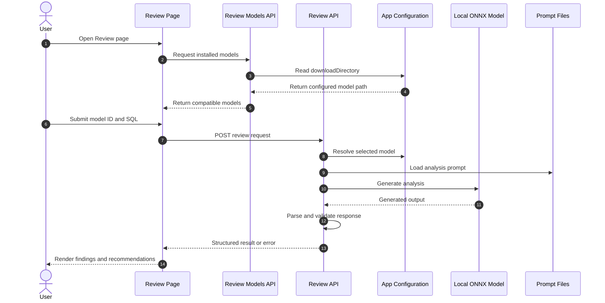
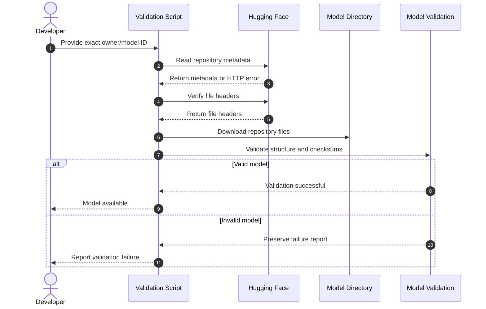
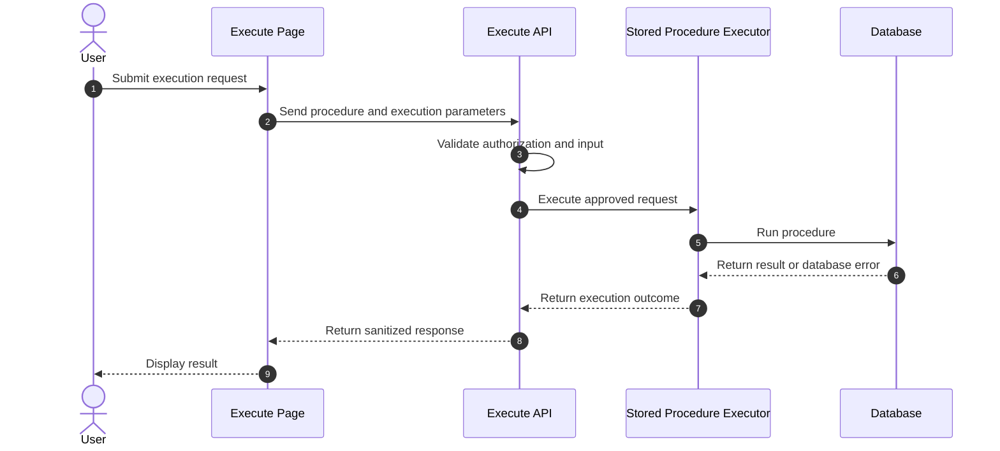

# Product & Technical Roadmap

## Executive Audit Summary

- **Current Version:** Not declared in the repository inventory
- **Pass 1 — Code and artifact discovery:** Completed from supplied `git ls-files` output
- **Pass 2 — Execution and state verification:** Requires local execution
- **Pass 3 — Delta analysis and reality check:** Requires local branch and content inspection
- **Primary Stack:** Next.js, TypeScript, React, Python, Prisma configuration, local ONNX inference
- **Persistence:** Database boundary exists at `src/db/index.ts`; schema and migration files were not present in the supplied inventory
- **Release Gate:** Not ready for approval until build, lint, route smoke tests, and model workflows are verified

The repository contains a Next.js application for SQL stored-procedure analysis, model management, SQL execution, comparison, auditing, authentication, and shared results. The source inventory confirms these boundaries, but implementation completeness and runtime behavior require local verification.

## Roadmap Overview Matrix

| Domain | Feature | Description | Status | Phase |
| :--- | :--- | :--- | :--- | :--- |
| Core Engine | Local ONNX inference | Runs analysis through the local transformer integration | `[IN-PROGRESS]` | Phase 1 |
| Core Engine | Prompt-driven analysis | Uses prompts under `data/prompts/` for SQL analysis | `[IN-PROGRESS]` | Phase 1 |
| Model Management | Model discovery | Lists installed models from configured storage | `[IN-PROGRESS]` | Phase 1 |
| Model Management | Hugging Face download | Downloads and validates model repositories | `[IN-PROGRESS]` | Phase 1 |
| API Layer | Review API | Accepts SQL and returns model analysis | `[IN-PROGRESS]` | Phase 1 |
| API Layer | Analysis API | Provides analysis operations | `[IN-PROGRESS]` | Phase 1 |
| API Layer | Audit API | Provides audit-oriented analysis | `[IN-PROGRESS]` | Phase 1 |
| API Layer | Execute API | Exposes stored-procedure execution behavior | `[IN-PROGRESS]` | Phase 2 |
| API Layer | Compare API | Supports comparison operations | `[IN-PROGRESS]` | Phase 2 |
| API Layer | Share API | Serves shared results by token | `[IN-PROGRESS]` | Phase 2 |
| Security | Authentication endpoints | Provides login, logout, and current-user routes | `[IN-PROGRESS]` | Phase 2 |
| UI/UX | Review interface | Provides model selection and SQL review workflow | `[IN-PROGRESS]` | Phase 1 |
| UI/UX | Model management interface | Provides model-management screens | `[IN-PROGRESS]` | Phase 1 |
| UI/UX | Compare and execute screens | Provides comparison and execution interfaces | `[IN-PROGRESS]` | Phase 2 |
| Persistence | Database integration | Exposes a database access boundary | `[IN-PROGRESS]` | Phase 2 |
| Quality | Automated tests | No tracked test files were shown in the supplied inventory | `[PLANNED]` | Phase 1 |
| Documentation | Architecture documentation | Documents routes, modules, setup, and model workflows | `[IN-PROGRESS]` | Phase 1 |

## Detailed Feature Itemization

### 1. Local ONNX Inference — `[IN-PROGRESS]`

**Feature scope:** Load a locally installed model and generate SQL analysis.

**Current technical state:** `src/lib/ai-transformer.ts` and model-related modules exist. Runtime success, model compatibility, and error handling require execution verification.

**Business impact:** Enables local analysis without sending SQL to a remote inference service.

### 2. Prompt-Driven Analysis — `[IN-PROGRESS]`

**Feature scope:** Use standard, very-large-context, and statistics prompts.

**Current technical state:** The following prompt files exist:

- `data/prompts/analysisSP.md`
- `data/prompts/analysisSP-verylarge.md`
- `data/prompts/explainStatistic.md`

**Business impact:** Provides consistent review behavior and specialized analysis modes.

### 3. Model Management — `[IN-PROGRESS]`

**Feature scope:** Discover, download, validate, refresh, and select local models.

**Current technical state:** Relevant modules include:

- `src/lib/installed-models.ts`
- `src/lib/model-store.ts`
- `src/lib/model-path.ts`
- `src/lib/model-validation.ts`
- `src/lib/validate-model.ts`
- `src/lib/huggingface-download.ts`
- `src/app/api/models/download/route.ts`
- `src/app/api/models/refresh/route.ts`
- `src/app/api/review/models/route.ts`
- `scripts/validate_and_download_model.py`

**Business impact:** Allows developers to manage supported models without manually editing application code.

### 4. Review API — `[IN-PROGRESS]`

**Feature scope:** Receive a model identifier and SQL text, invoke analysis, and return structured results.

**Current technical state:** Implemented at `src/app/api/review/route.ts`. Request validation, response parsing, and runtime behavior require smoke testing.

**Business impact:** Forms the primary automated SQL-review workflow.

### 5. Execution and Comparison — `[IN-PROGRESS]`

**Feature scope:** Execute procedures and compare SQL or analysis results.

**Current technical state:** Routes and UI files exist:

- `src/app/api/execute/route.ts`
- `src/app/api/compare/route.ts`
- `src/app/execute/page.tsx`
- `src/app/compare/page.tsx`
- `src/lib/sp-executor.ts`

**Business impact:** Adds operational validation beyond static model analysis. This area requires strict authorization, connection, timeout, and audit controls.

### 6. Authentication and Sharing — `[IN-PROGRESS]`

**Feature scope:** Authenticate users and expose shared analysis results.

**Current technical state:** Authentication routes exist under `src/app/api/auth/`; sharing exists under `src/app/api/share/[token]/route.ts` and `src/app/share/[token]/page.tsx`.

**Business impact:** Supports controlled access to application features and review results.

### 7. Database Integration — `[IN-PROGRESS]`

**Feature scope:** Provide persistence through a centralized database boundary.

**Current technical state:** `src/db/index.ts` and `prisma.config.ts` exist. No Prisma schema or migration files were present in the supplied inventory.

**Business impact:** Persistence capabilities cannot be considered release-ready until schema ownership and migration procedures are documented and tested.

### 8. Automated Testing — `[PLANNED]`

**Feature scope:** Add tests for APIs, model discovery, authentication, prompt parsing, execution safeguards, and UI-critical workflows.

**Current technical state:** No tracked test files were shown in the supplied inventory.

**Business impact:** Testing is required to prevent regressions in model loading, SQL handling, authentication, and destructive execution paths.

## Repository Architecture

```text
sqlens/
├── data/
│   ├── appconfig.json
│   └── prompts/
├── docs/
├── scripts/
│   └── validate_and_download_model.py
└── src/
    ├── app/
    │   ├── api/
    │   └── <feature pages>
    ├── components/
    ├── db/
    └── lib/
```

The architecture separates:

- App Router pages and API routes under `src/app/`
- Reusable UI under `src/components/`
- Infrastructure and domain utilities under `src/lib/`
- Database access under `src/db/`
- Runtime prompts and configuration under `data/`
- Model acquisition tooling under `scripts/`

## Detailed Architectural Workflows

### Review Workflow — `[IN-PROGRESS]`



### Model Download Workflow — `[IN-PROGRESS]`



### Execution Workflow — `[IN-PROGRESS]`



This workflow is marked `[IN-PROGRESS]` because database safety, authorization, timeout, and audit behavior were not verified by the supplied inventory.

## Required Verification Before Release

Run locally:

```bash
git status --short
node -e "console.log(require('./package.json').scripts)"
find src/app -type f -print | sort
find . -type f \( -name '*test*' -o -name '*spec*' \) -not -path './node_modules/*'
rg -n 'TODO|FIXME|throw new Error|NotImplemented|return null' src scripts
git branch --all
npm run
npm run build
```

Also verify:

1. Every API route has a working request and response contract.
2. Every UI page is reachable through navigation.
3. Model discovery uses `data/appconfig.json`.
4. Invalid and incomplete models are excluded.
5. Authentication protects required routes.
6. Share tokens cannot expose unauthorized results.
7. Execute requests cannot run without explicit authorization.
8. Database schema and migration ownership are defined.
9. SQL and access tokens are not written to logs.
10. Documentation links resolve locally.

## Release Gate

**Status: `[IN-PROGRESS]`**

The source inventory demonstrates a substantial application skeleton and multiple integrated feature areas. Release approval remains blocked until Passes 2 and 3 are executed locally, route behavior is tested, security-sensitive execution paths are reviewed, and automated test coverage is added.

## Table of Contents

1. [Executive Audit Summary](#executive-audit-summary)
2. [Audit Method and Evidence](#audit-method-and-evidence)
3. [Roadmap Overview Matrix](#roadmap-overview-matrix)
4. [Repository Architecture](#repository-architecture)
5. [Detailed Feature Itemization](#detailed-feature-itemization)
6. [Architectural Workflows](#detailed-architectural-workflows)
7. [Configuration and Environment](#configuration-and-environment)
8. [Security and Operational Controls](#security-and-operational-controls)
9. [Quality and Release Gates](#quality-and-release-gates)
10. [Completed Items](#completed-items)

## Audit Method and Evidence

The audit uses three passes:

### Pass 1 — Code and Artifact Discovery

Evidence reviewed:

- Tracked repository file list from `git ls-files`.
- Next.js App Router routes and pages.
- TypeScript library modules.
- Python model-download utility.
- Prompt and application configuration files.
- npm, TypeScript, ESLint, PostCSS, Next.js, and Prisma configuration files.
- Existing documentation files.

### Pass 2 — Execution and State Verification

This pass requires local execution and source inspection. The supplied inventory confirms route and module presence but does not prove that every workflow is functional.

The following items remain runtime verification tasks:

- API request and response behavior.
- Authentication enforcement.
- Share-token authorization.
- Database connectivity.
- Stored-procedure execution safety.
- Model download completion.
- ONNX model compatibility.
- Client navigation coverage.
- Production build behavior.

### Pass 3 — Delta Analysis and Reality Check

The following checks must be run locally before release:

```bash
git status --short
git branch --all
rg -n 'TODO|FIXME|NotImplemented|throw new Error|return null' src scripts
find . -type f \( -name '*test*' -o -name '*spec*' \) \
  -not -path './node_modules/*' \
  -not -path './.next/*'
npm run
```

No feature is marked `[COMPLETED]` solely because a file or route exists.

## Repository Architecture

The repository contains four primary application boundaries:

| Boundary | Location | Responsibility |
|---|---|---|
| Presentation | `src/app/`, `src/components/` | Pages, navigation, forms, result rendering, and client state. |
| HTTP/API | `src/app/api/` | Request validation, authentication, orchestration, and response formatting. |
| Domain/infrastructure | `src/lib/` | Model loading, configuration, auditing, execution, downloading, and validation. |
| Persistence | `src/db/`, `prisma.config.ts` | Database access and Prisma tooling configuration. |

The repository also contains:

- `data/` — runtime configuration and analysis prompts.
- `scripts/` — model validation and download tooling.
- `docs/` — project reference documentation.
- `.agents/skills/archify/` — repository tooling for architecture artifact generation.
- `downloads/models/` — local model storage and should remain untracked.
- `scripts/__pycache__/` — generated Python bytecode and should remain untracked.

### Architecture tooling

The `.agents/skills/archify/` tree is developer tooling, not part of the SQLens runtime. It contains:

- Rendering commands.
- Architecture, workflow, lifecycle, sequence, and dataflow renderers.
- JSON schemas.
- Rendering examples.
- Validation scripts.
- Automated tests for the Archify skill.

Changes under this directory should not be described as product runtime features.

## Route Inventory

The following route files were present in the supplied repository inventory:

| Route | Purpose |
|---|---|
| `/api/analysis` | Analysis operations. |
| `/api/appconfig` | Application configuration access. |
| `/api/audit` | Audit analysis operations. |
| `/api/auth/login` | User login. |
| `/api/auth/logout` | User logout. |
| `/api/auth/me` | Current-user/session information. |
| `/api/compare` | Comparison operations. |
| `/api/execute` | Stored-procedure execution operations. |
| `/api/models/download` | Model download requests. |
| `/api/models/refresh` | Model inventory refresh. |
| `/api/review/models` | Models available to the review UI. |
| `/api/review` | SQL review requests. |
| `/api/share/[token]` | Shared-result access by token. |

Route presence does not establish that a route is linked from the UI, authenticated, production-safe, or covered by tests.

## Application Pages and Components

| File | Responsibility |
|---|---|
| `src/app/page.tsx` | Application landing page. |
| `src/app/review/page.tsx` | Stored-procedure review workflow. |
| `src/app/compare/page.tsx` | Comparison workflow. |
| `src/app/execute/page.tsx` | SQL execution workflow. |
| `src/app/manage-models/page.tsx` | Model-management workflow. |
| `src/app/settings/page.tsx` | Settings workflow. |
| `src/app/share/[token]/page.tsx` | Shared-result display. |
| `src/app/providers.tsx` | Application-level providers. |
| `src/app/layout.tsx` | Root layout and metadata. |
| `src/components/AppShell.tsx` | Shared application shell. |
| `src/components/layout/Navbar.tsx` | Primary navigation. |
| `src/components/review/ReviewPanel.tsx` | Review-specific UI composition. |

## Library and Infrastructure Modules

| Module | Responsibility |
|---|---|
| `ai-transformer.ts` | Local model inference integration. |
| `app-config.ts` | Application configuration loading. |
| `audit-analyzer.ts` | Audit analysis logic. |
| `datadog-analyzer.ts` | Datadog-related analysis logic. |
| `huggingface-download.ts` | Hugging Face model download integration. |
| `installed-models.ts` | Discovery of installed models. |
| `model-path.ts` | Model path resolution. |
| `model-store.ts` | Model storage and lifecycle operations. |
| `model-validation.ts` | Downloaded model validation. |
| `validate-model.ts` | Model validation helpers or orchestration. |
| `sp-executor.ts` | Stored-procedure execution boundary. |
| `src/db/index.ts` | Database access boundary. |

## Configuration and Environment

The primary runtime configuration is:

```json
{
  "downloadDirectory": "~/dev/dbPro/sqlens/downloads/models"
}
```

The application must resolve `downloadDirectory` at runtime. It must not depend on a developer-specific absolute path.

Expected environment-sensitive areas include:

- Hugging Face authentication for model downloads.
- Database connection settings for execution and persistence.
- Authentication/session configuration.
- Application runtime configuration.

Inspect actual environment-variable usage before adding variables to documentation:

```bash
rg -n 'process\.env|os\.environ|HF_TOKEN|DATABASE_URL' \
  src scripts prisma.config.ts
```

Secrets must be supplied through environment configuration or an approved secret manager. They must not be stored in `keys.md`, source files, prompts, README files, or committed documentation.

## Data and Prompt Contracts

The prompt files are:

- `data/prompts/analysisSP.md`
- `data/prompts/analysisSP-verylarge.md`
- `data/prompts/explainStatistic.md`

Prompt changes can alter:

- Required model output fields.
- Severity values.
- Finding categories.
- Rewrite behavior.
- Confidence interpretation.
- Token usage and generation limits.

Any prompt-schema change must be reviewed together with:

- API response parsing.
- TypeScript result types.
- UI rendering.
- Error handling.
- Documentation examples.

## Model Lifecycle

The model lifecycle has these stages:

1. Repository selection.
2. Repository metadata lookup.
3. File validation.
4. Download to a temporary or target directory.
5. Checksum and structure validation.
6. Registration or discovery.
7. Review-page selection.
8. Local inference.
9. Cleanup or preservation of failed downloads.

A model must not appear in the Review dropdown merely because its directory exists. Discovery must verify the required configuration, tokenizer, metadata, and ONNX runtime assets.

Safetensors, GGUF, and MLX files must not be renamed to ONNX filenames. File renaming does not convert model formats.

## Security and Operational Controls

The following controls are required before production release:

- Authenticate protected API routes.
- Authorize model-management operations.
- Validate model identifiers against installed model metadata.
- Restrict filesystem access to configured model directories.
- Do not execute arbitrary SQL without explicit authorization and safeguards.
- Apply execution timeouts and result-size limits.
- Sanitize database errors before returning them to clients.
- Protect share tokens against guessing and unauthorized access.
- Avoid logging SQL text, credentials, access tokens, or connection strings.
- Validate all model-generated JSON before rendering or persisting it.
- Review licenses before redistributing downloaded models.

## Quality and Release Gates

### Build and static checks

Run only commands declared in `package.json`:

```bash
node -e "console.log(require('./package.json').scripts)"
npm run
npm run build
```

Validate the Python utility:

```bash
python3 -m py_compile scripts/validate_and_download_model.py
```

Check whitespace errors:

```bash
git diff --check
git diff --cached --check
```

### Documentation checks

```bash
python3 - <<'PY'
import re
from pathlib import Path

for source in [Path("README.md"), *Path("docs").glob("*.md")]:
    text = source.read_text()
    for target in re.findall(r"\]\(([^)]+)\)", text):
        if target.startswith(("http://", "https://", "#")):
            continue
        target = target.split("#", 1)[0]
        resolved = (source.parent / target).resolve()
        if not resolved.is_file():
            print(f"{source}: missing local link: {target}")
PY
```

### Release decision

The release gate remains `[IN-PROGRESS]` until:

1. The production build succeeds.
2. Every active API route has a verified contract.
3. Authentication and sharing controls are tested.
4. SQL execution safeguards are reviewed.
5. Model download and discovery workflows succeed.
6. Automated tests exist for security-sensitive and core workflows.
7. Database schema and migration ownership are defined.
8. Documentation accurately reflects the implemented behavior.

## Completed Items

The following audit and documentation items are complete based on the supplied repository evidence:

1. **Pass 1 artifact inventory completed** — tracked routes, pages, libraries, prompts, configuration files, scripts, and documentation files were identified.
2. **Application boundary mapping completed** — presentation, API, infrastructure, persistence, data, scripts, and developer-tooling boundaries were documented.
3. **Route inventory documented** — the available API route files were listed without treating file presence as runtime proof.
4. **Prompt inventory documented** — all three tracked prompt files were identified.
5. **Model-management surface documented** — model download, validation, storage, path, discovery, and refresh modules were mapped.
6. **Release-gate criteria documented** — build, security, model, database, testing, and documentation checks were defined.
7. **Roadmap status discipline applied** — unverified features remain `[IN-PROGRESS]` or `[PLANNED]`; no runtime feature is incorrectly marked `[COMPLETED]`.
8. **Documentation maintenance requirements documented** — future route, prompt, configuration, and workflow changes must update the corresponding documentation.